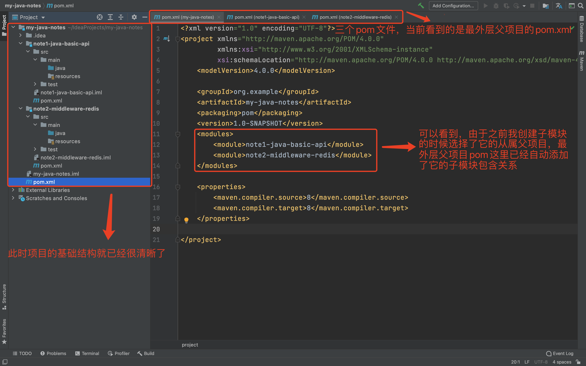

# my-java-notes
"南派三叔有盗墓笔记，我有java笔记，探索总要留下痕迹，可为后人指点迷津。"

开篇就记录两件事情：

- 如何新建一个多模块项目？
- 如何把本地项目提交到远程仓库？

## 1. 如何新建一个多模块项目？

### 1.1 使用IDEA新建项目


### 1.2 新建项目中选择Maven和自己的JDK版本去创建


### 1.3 填写项目名称


### 1.4 maven项目创建成功后的结构


### 1.5 给项目新建几个子模块module


### 1.6 新建模块与前面的新建项目步骤基本相同并要给子模块指定属于哪个项目


### 1.7 创建好模块后可以删除它父项目结构中的多余文件


### 1.8 项目基本结构已经清晰了




## 2. 如何把本地项目提交到远程仓库？

### 2.1 在GitHub创建远程仓库


### 2.2 本地项目关联到git管理


### 2.3 添加项目文件到git暂存区


### 2.4 回滚无用的文件


### 2.5 回滚无用的git文件


### 2.6 去除无用的git管理后的样子


### 2.7 git命令提交文件到本地仓库


### 2.8 把本地库与远程库关联


### 2.9 合并本地与远程仓库代码


### 2.10 本地仓库提交到远程仓库


### 2.11 查看远程仓库已经有了本地代码


### 2.12 最后收拾一下


## 给远程仓库生产密钥
````
git config --global user.name "git的用户名" // 配置git账号

git config --global user.email "git的邮箱" // 配置git邮箱

ssh-keygen -t rsa -C "git的邮箱" // 根据用户名及邮箱生成密钥，复制密钥到GitHub配置SSH

````

## 添加到远程仓库git命令
````
git init   // 初始化版本库

git add .   // 添加文件到缓存区，"." 代表添加文件夹下所有文件，新项目建议IDEA中挨个手动添加

git commit -m "first commit" // 把添加的文件提交到本地仓库，并填写提交备注

git remote add origin 你的远程仓库地址  // 把本地库与远程仓库关联

git pull --allow-unrelated-histories  // 第一次推送前，要从远程仓库pull代码可用这个命令，防止远程库有历史版本冲突

git push -u origin master    // 第一次推送时用到-u参数

git push origin master  // 第一次推送后，不再需要-u参数
````